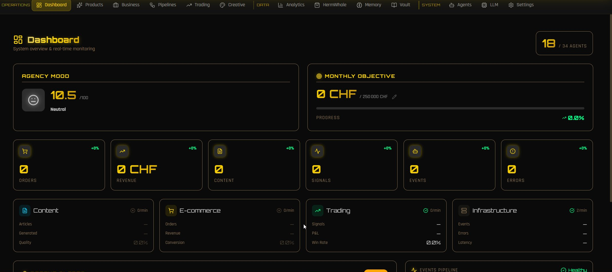
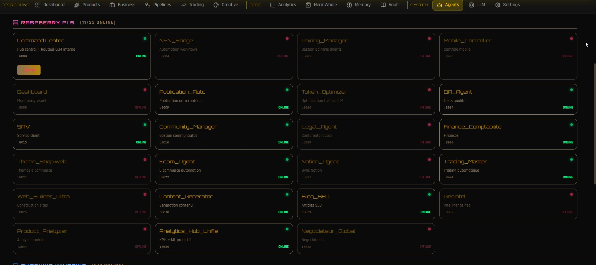
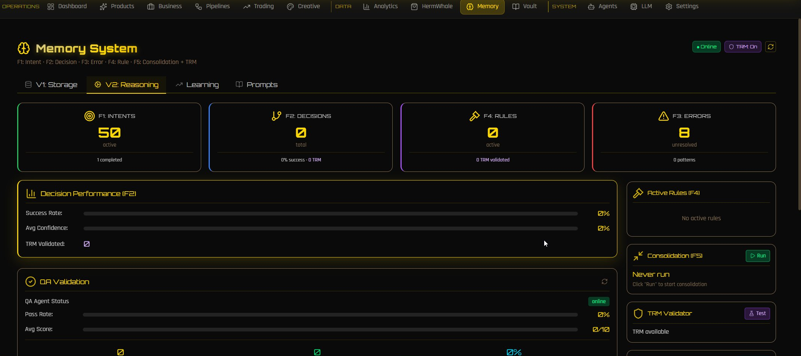

# Talos - A Distributed Agentic Operating System

Talos is the autonomous, fully-agentic platform I designed and built. It detects
opportunities, produces assets, runs commerce, sales, trading, and creative work,
talks to its operator by voice or chat, and improves its own capabilities over
time - across a four-node fleet, mostly on local models. It behaves less like a
collection of scripts and more like an operating system for agents.

## At a glance

- **4-node compute fleet**, specialized by role (control/business, two GPU nodes, support).
- **~60,000 files**, ~16,000 Python modules.
- **~55 agents** and **85+ services**, discovered through a single registry.
- **44 local language models** served via a hot-swapping gateway, plus cloud models.
- **MQTT event bus** (60+ event namespaces) wiring every component together.
- **Cumulative vector memory**: 690,000+ points across 12 collections.
- Real-time voice stack, full observability, and self-healing.

## Dashboard

The control surface: a real-time view of every node, agent, pipeline, and KPI,
with a built-in voice and chat assistant.

## What it does

**Commerce & marketing.** Async integrations with Shopify, WooCommerce, Stripe,
Printful, dropshipping suppliers, and TikTok Shop, plus ML engines for pricing,
demand forecasting, recommendation, customer-lifetime-value, fraud detection,
sentiment, product enrichment, and visual search. Storefronts, catalogs, and
campaigns run with little to no human input.

**Autonomous sales.** A full pipeline - prospection, qualification, negotiation,
closing - with a deal ledger, a compliance guard, and self-hosted eIDAS-grade
e-signature. Validated end to end.

**Trading.** A research-and-execution stack: strategy models, time-series
forecasting, and a reinforcement-learning world model that simulates business and
market decisions before they are taken.

**Creative & content.** Long-form and social content generation, SEO articles,
community management, image and video generation, and scheduled multi-channel
publication.

**Voice & multimodal assistant.** A real-time conversational assistant drives the
platform by voice or chat: streaming speech in and out, speaker identification,
vision, and document understanding (OCR, parsing). Ask it for a status, a report,
or an action and it routes the request to the right agent.

**Builders.** Generators that produce web apps, games, and storefront themes, plus
self-improving dev pipelines (audit / build / architect) that scan, generate, and
refactor code and infrastructure under execution verifiers.

## How it thinks

A cognitive layer keeps the system improving rather than merely running, built as a
stack. An analytics hub is the strategic brain coupled to the Command Center: it
consolidates KPIs, finance, and ML predictions, supervises the fleet, and acts on
agents directly. Its predictive level goes beyond Monte Carlo, with two live stages:
time-series forecasting (Chronos-class) and a reinforcement-learning world model
(DreamerV3-class) that imagines the consequences of a decision before it is taken,
trained on the platform's own real outcomes; a causal-reasoning stage is in progress.
Above it, adaptive governance switches strategic mode from live metrics, a shared
strategic-state graph is the common ground, and a reality-alignment check recalibrates
it against actual impact. Around it, a closed self-evaluation loop: recursive
validators, multi-layer QA with self-healing tests, a reflection mechanism that learns
from past mistakes, a learning engine (A/B canary and evolutionary search), and
experiment and drift monitors. A skill manager turns gaps into new reusable
capabilities. Long-horizon planning and a meta-research engine are being added.

## Memory

Four complementary systems, not one store: a structured knowledge wiki (raw to wiki
to index, link graph, full-text search, note lifecycle) compiled by a librarian; an
episodic memory of intents, decisions, errors, and reflections with graceful decay; a
shared, versioned strategic-state graph used by the cognitive modules as common
ground; and a retention manager that ages, archives, and purges under time-to-live
policies. A vector knowledge base and embeddings give every agent durable, searchable
context.

## How it's operated

**Command center & dashboard.** A control plane classifies each request, routes it
to the right agent and model, manages lifecycle, and surfaces everything in a live
dashboard with the built-in voice/chat assistant. A mobile controller and Notion
sync extend control beyond the desk.

**Research & knowledge.** An autonomous research agent gathers and synthesizes
external sources; a knowledge backbone (embeddings, a librarian, vector search,
document ingestion) gives every agent durable, searchable context.

**Reliability & observability.** An autonomous reliability layer (SOC plus SRE)
detects anomalies, correlates them, drives incidents through a state machine, and
remediates from runbooks with LLM-assisted investigation, on top of a
metrics/logs/alerting stack and data-governance services (schema registry,
validators, retention, aggregation), plus defensive security and compliance
monitoring. Business-support agents handle finance, accounting, legal, and customer
service.

## Architecture

Talos is organized into planes: a **control plane** (orchestration, routing,
lifecycle, dashboard), a **knowledge plane** (a four-part memory of knowledge wiki,
episodic store, strategic state, and retention, plus research and skill generation),
an **execution plane** (business, creative, and trading agents), a **cognitive
layer** (a stack from prediction and governance to shared state, with long-horizon
planning and meta-research being added), and a **reliability plane** (observability
and self-healing). An MQTT event bus and a local-model gateway connect them across
the fleet.

## How it's built

Python (async-first) · local LLM ops (llama.cpp / GGUF, model routing, VRAM-aware
hot-swap) · multi-agent orchestration · graph-RAG memory · vector database · MQTT
event bus · real-time voice (streaming STT/TTS, speaker ID) · Prometheus-compatible
metrics, logs, and alerting · reverse-proxy + WAF ingress · systemd · CI with ruff,
pytest, and pre-commit.

## Engineering principles

- Execution-verified generation over single-shot prompting.
- Constrained decoding for valid output; ensemble judges to catch semantic false positives.
- Defense-in-depth - multiple independent checks, never one prompt.
- Metrics-driven: every change is measured; if it isn't reproducible, it isn't done.

## Open-source components

Parts of the infrastructure are extracted, generalized, and released as
standalone libraries:

- [agent-resilience](https://github.com/Musyg/agent-resilience) - circuit breaker, Redis-backed DLQ, and offline MQTT buffer.
- [async-api-client](https://github.com/Musyg/async-api-client) - resilient async REST client with rate limiting, retries, and pagination.
- [multi-agent-orchestrator](https://github.com/Musyg/multi-agent-orchestrator) - capability-based task routing template.

The platform itself is private; the components above are the parts released under MIT.
